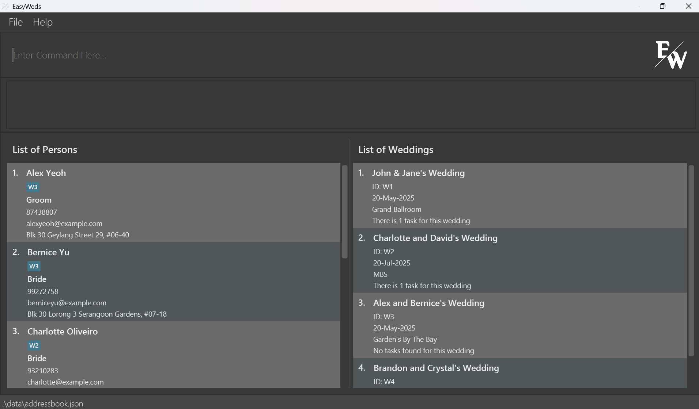
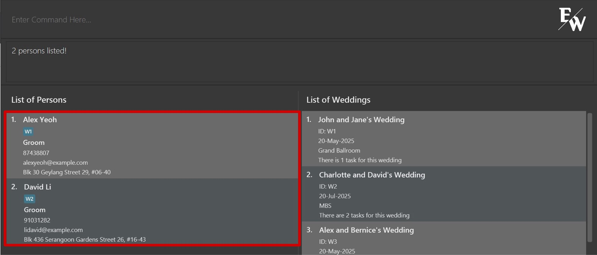

# EasyWeds User Guide

EasyWeds is a **desktop app designed for freelance wedding planners juggling multiple weddings**. It streamlines planning by centralising vendor and client information and keeping every wedding detail organised. If you are adept at typing, EasyWeds empowers you to swiftly access and update your planning data.

<!-- * Table of Contents -->
<page-nav-print />

--------------------------------------------------------------------------------------------------------------------

## Quick start

1. Ensure you have Java `17` or above installed in your Computer. 
   **Mac users:** Ensure you have the precise JDK version prescribed [here](https://se-education.org/guides/tutorials/javaInstallationMac.html).

1. Download the latest `.jar` file from [here](https://github.com/se-edu/addressbook-level3/releases).

1. Copy the file to the folder you want to use as the _home folder_ for your EasyWeds.

1. Open a command terminal, `cd` into the folder you put the jar file in, and use the `java -jar addressbook.jar` command to run the application. 
   A GUI similar to the below should appear in a few seconds. Note how the app contains some sample data. 
   

1. Type the command in the command box and press Enter to execute it. e.g. typing **`help`** and pressing Enter will open the help window. 
   Some example commands you can try:

   * `list` : Lists all contacts.

   * `add n/John Doe p/98765432 e/johnd@example.com a/John street, block 123, #01-01 r/Photographer` : Adds a contact named `John Doe` to the contact book in EasyWeds.

   * `delete 3` : Deletes the 3rd contact shown in the current list.

   * `clear` : Deletes all contacts.

   * `exit` : Exits the app.

1. Refer to the [Features](#features) below for details of each command.

--------------------------------------------------------------------------------------------------------------------

## Features

<box type="info" seamless>

**Notes about the command format:** 

* Words in `UPPER_CASE` are the parameters to be supplied by the user. 
  e.g. in `add n/NAME`, `NAME` is a parameter which can be used as `add n/John Doe`.

* Items in square brackets are optional. 
  e.g `n/NAME [r/ROLE]` can be used as `n/John Doe r/Florist` or as `n/John Doe`.

* Items with `…`​ after them can be used multiple times including zero times. 
  e.g. `[t/TAG]…​` can be used as ` ` (i.e. 0 times), `t/friend`, `t/friend t/family` etc.

* Parameters can be in any order. 
  e.g. if the command specifies `n/NAME p/PHONE_NUMBER`, `p/PHONE_NUMBER n/NAME` is also acceptable.

* Extraneous parameters for commands that do not take in parameters (such as `help`, `list`, `exit` and `clear`) will be ignored. 
  e.g. if the command specifies `help 123`, it will be interpreted as `help`.

* If you are using a PDF version of this document, be careful when copying and pasting commands that span multiple lines as space characters surrounding line-breaks may be omitted when copied over to the application.
</box>

### Viewing help : `help`

Shows a message explaining how to access the help page.

Format: `help`

### Adding a person : `add`

Adds a person to the contact book.

Format: `add n/NAME p/PHONE_NUMBER e/EMAIL a/ADDRESS r/ROLE`

<box type="tip" seamless>

</box>

Examples:
* `add n/John Doe p/98765432 e/johnd@example.com a/John street, block 123, #01-01 r/Photographer`
* `add n/Betsy Crowe r/Florist e/betsycrowe@example.com a/Newgate Prison p/1234567`

**Note:** A person with a similar name to an existing person in the contacts will be flagged out
* If there is a Person with the name `Alex Yeoh` in the contacts, the following will be flagged out:
    * `alex<space>yeoh` (no capitalization)
    * `Alex<space><space>Yeoh` (extra spacing)
    * `Alex<space><space>yeoh` (combination of the 2)
* In such a case, the potential duplicate is spotted and the User will need to confirm if he wants to add this Person or make a change to the input
  
* Once you receive the warning message, you can choose to either:
    1. Confirm - Use 'Ctrl / Command + A' to select the whole input text and press 'Delete / Backspace' to clear the input box. Afterwards, input the command `y` which will add this Person into the contact list.
    2. Cancel - Edit the current input in your input box. Once no duplicates are detected, when you press 'Enter', this Person will be added into the contact list.

### Adding a Wedding Event : `addWedding`

Adds a Wedding Event to the contact book.

Format: `addWedding n/NAME d/DATE l/LOCATION`

Examples:
* `addWedding n/John & Jane's Wedding d/20-Feb-2025 l/Marina Bay Sands`

### Listing all persons : `list`

Shows a list of all persons in the contact book.

Format: `list`

### Listing all Wedding Events : `listWedding`

Shows a list of all Wedding Events in the contact book.

Format: `listWedding`

### Editing a person : `edit`

Edits an existing person in the contact book.

Format: `edit INDEX [n/NAME] [p/PHONE] [e/EMAIL] [a/ADDRESS] [r/ROLE]`

* Edits the person at the specified `INDEX`. The index refers to the index number shown in the displayed person list. The index **must be a positive integer** 1, 2, 3, …​
* At least one of the optional fields must be provided.
* Existing values will be updated to the input values.

Examples:
*  `edit 1 p/91234567 e/johndoe@example.com` Edits the phone number and email address of the 1st person to be `91234567` and `johndoe@example.com` respectively.
*  `edit 2 n/Betsy Crower r/photographer` Edits the name of the 2nd person to be `Betsy Crower` and her role to `photographer`.

### Editing a Wedding Event : `editWedding`

Edit an existing Wedding Event in the contact book.

Format: `editWedding [weddingId] [n/NAME] [d/DATE] [l/LOCATION]`

* Edits the Wedding Event at the specified `weddingId`.
* At least one of the optional fields must be provided.
* Existing values will be updated to the input values.
* Details of wedding you want to edit cannot be the same as what is already in the wedding.

Examples:
* `editWedding W1 d/20-Feb-2025 l/Marina Bay Sands` Edits the date and location of the 1st Wedding Event to be `20-Feb-2025` and `Marina Bay Sands` respectively.
* `editWedding W2 n/John & Jane's Wedding` Edits the name of the 2nd Wedding Event to be `John & Jane's Wedding`.

### Locating persons by name : `find`

Finds persons whose names or roles contain any of the given keywords.

Format: `find KEYWORD [MORE_KEYWORDS]`

* The search is case-insensitive. e.g `hans` will match `Hans`
* The order of the keywords does not matter. e.g. `Hans Bo` will match `Bo Hans`
* Either the name or the role will be searched.
* Only full words will be matched e.g. `Han` will not match `Hans`
* Persons matching at least one keyword will be returned (i.e. `OR` search).
  e.g. `Hans Bo` will return `Hans Gruber`, `Bo Yang`

Examples:
* `find John` returns `john` and `John Doe`
* `find florist` returns all Persons with a role of `florist`
* `find alex david` returns `Alex Yeoh`, `David Li` 

  

### Tagging a person to a Wedding : `tag`

Tags an existing contact to an existing wedding event.

Format: `tag INDEX WEDDING_ID`

* Tags the person at the specified `INDEX` to the wedding event specified by `WEDDING_ID`.
* The index refers to the index number shown in the displayed person list. The index **must be a positive integer** 1, 2, 3, …​
* Wedding id is the unique identifier of the wedding event.
* Contacts can only be tagged to wedding events that are already existing in the system.
* Each contact can be tagged to more than one wedding event.

Examples:
* `tag 1 W1` tags the first person to the wedding event with weddingId `W1`
* `tag 1 W2` tags the first person to the wedding event with weddingId `W2`. Now the first person will be tagged to both `W1` and `W2`.

### Untagging a person : `untag`

### Filtering contacts : `filter`

Filters contacts related to a specified wedding id.

Format: `filter WEDDING_ID`

* Filters contacts that are tagged with the specified `WEDDING_ID`
* Wedding id is the unique identifier of the wedding event.
* Wedding details of the event specified by `WEDDING_ID` will be displayed on the message output box.

Examples:
* `filter W4` displays the details of `W4` and returns the contacts that are tagged to `W4`.

  

### Deleting a person : `delete`

Deletes the specified person from the contact book.

Format: `delete INDEX`

* Deletes the person at the specified `INDEX`.
* The index refers to the index number shown in the displayed person list.
* The index **must be a positive integer** 1, 2, 3, …​

Examples:
* `list` followed by `delete 2` deletes the 2nd person in the address book.
* `find Betsy` followed by `delete 1` deletes the 1st person in the results of the `find` command.

### Deleting a Wedding Event : `deleteWedding`

### Clearing all entries : `clear`

Clears all entries from the contact book.

Format: `clear`

### Exiting the program : `exit`

Exits the program.

Format: `exit`

### Saving the data

EasyWeds data are saved in the hard disk automatically after any command that changes the data. There is no need to save manually.

### Editing the data file

EasyWeds data are saved automatically as a JSON file `[JAR file location]/data/addressbook.json`. Advanced users are welcome to update data directly by editing that data file.

<box type="warning" seamless>

**Caution:**
If your changes to the data file makes its format invalid, AddressBook will discard all data and start with an empty data file at the next run.  Hence, it is recommended to take a backup of the file before editing it. 
Furthermore, certain edits can cause the AddressBook to behave in unexpected ways (e.g., if a value entered is outside the acceptable range). Therefore, edit the data file only if you are confident that you can update it correctly.
</box>

### Archiving data files `[coming in v2.0]`

_Details coming soon ..._

--------------------------------------------------------------------------------------------------------------------

## FAQ

**Q**: How do I transfer my data to another Computer? 
**A**: Install the app in the other computer and overwrite the empty data file it creates with the file that contains the data of your previous AddressBook home folder.

--------------------------------------------------------------------------------------------------------------------

## Known issues

1. **When using multiple screens**, if you move the application to a secondary screen, and later switch to using only the primary screen, the GUI will open off-screen. The remedy is to delete the `preferences.json` file created by the application before running the application again.
2. **If you minimize the Help Window** and then run the `help` command (or use the `Help` menu, or the keyboard shortcut `F1`) again, the original Help Window will remain minimized, and no new Help Window will appear. The remedy is to manually restore the minimized Help Window.

--------------------------------------------------------------------------------------------------------------------

## Command summary

Action     | Format, Examples
-----------|----------------------------------------------------------------------------------------------------------------------------------------------------------------------
**Add**      | `add n/NAME p/PHONE_NUMBER e/EMAIL a/ADDRESS r/ROLE…​`   e.g., `add n/James Ho p/22224444 e/jamesho@example.com a/123, Clementi Rd, 1234665 r/Photographer`
**AddWedding** | `addWedding n/NAME d/DATE l/LOCATION`   e.g., `addWedding n/John and Jane's Wedding! d/20-Feb-2025 l/Marina Bay Sands
**Clear**    | `clear`
**Delete**   | `delete INDEX`  e.g., `delete 3`
**DeleteWedding** | 
**Edit**     | `edit INDEX [n/NAME] [p/PHONE_NUMBER] [e/EMAIL] [a/ADDRESS] [r/ROLE]…​`  e.g.,`edit 2 n/James Lee e/jameslee@example.com`
**EditWedding** |
**Filter**   | `filter WEDDING_ID`   e.g., `filter W4`
**Find**     | `find KEYWORD [MORE_KEYWORDS]`   e.g., `find James Jake`
**List**     | `list`
**Tag**      | `tag INDEX WEDDING_ID`   e.g., `tag 1 W1`
**Untag**    |
**Help**     | `help`
